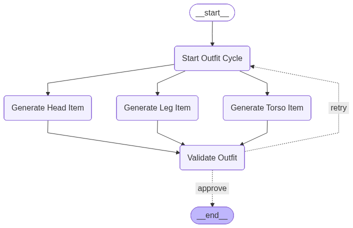

# 🧥 Outfit Gender Classification Workflow (Full Stack Edition)

A fully containerized **LangGraph + FastAPI backend** and **Django + React frontend** delivering a complete, modern, production‑ready outfit generation workflow.

This system:

- Generates **head, torso, and leg clothing items in parallel**
- Classifies each item as **male**, **female**, or **none**
- Validates if the outfit is gender‑consistent
- Retries generation intelligently until consistent or `MAX_ATTEMPTS`
- Exposes a **REST API** via FastAPI
- Provides a **modern web UI** (Django + CDN React)
- Runs locally **and** via **Docker Compose**
- Auto‑generates a workflow diagram:  
  **`workflow_graph.png`**

---

# 🚀 Features

## 🔷 Parallel Generation (LangGraph)

Three independent nodes run concurrently:

- **Head clothing**
- **Torso clothing**
- **Leg clothing**

## 🔷 Smart Validation Logic

The workflow ensures:

| Condition          | Result                        |
| ------------------ | ----------------------------- |
| All items → male   | ✔ Approved                    |
| All items → female | ✔ Approved                    |
| Mixed / none       | ❌ Retry (until max attempts) |

`none` is only used for _invalid or unreadable items_, not unisex clothing.

## 🔷 API‑Driven Architecture

Your LangGraph workflow is wrapped in a clean, modern **FastAPI** service:

- `POST /generate-outfit` → runs the workflow
- `GET /health` → heartbeat

## 🔷 Modern Frontend

A simple yet polished UI built with:

- **Django** (backend for static & templating)
- **React (CDN, JSX via Babel)**

Frontend features:

- Generate button
- Live status
- Beautiful badges for genders and validation
- Displays all items and workflow attempts

## 🔷 Complete Docker Support

The entire system (API + Frontend) runs using:

```bash
docker compose up --build
```

---

# 🗂 Project Structure

```
outfit-workflow/
│
├── docker-compose.yml
├── .env
├── .env.example
│
├── api/
│   ├── Dockerfile
│   ├── requirements.txt
│   └── app/
│       ├── __init__.py
│       ├── main.py               # FastAPI service
│       └── outfit_workflow.py    # LangGraph workflow logic
│
└── web/
    ├── Dockerfile
    ├── requirements.txt
    ├── manage.py
    ├── web/
    │   ├── settings.py
    │   ├── urls.py
    │   ├── wsgi.py
    │   └── __init__.py
    └── ui/
        ├── views.py
        ├── urls.py
        ├── templates/ui/index.html
        └── static/ui/app.jsx
```

---

# ⚙️ Configuration

## `.env`

```
ANTHROPIC_API_KEY=YOUR_ANTHROPIC_API_KEY
MAX_ATTEMPTS=5
```

## `.env.example`

```
ANTHROPIC_API_KEY=
MAX_ATTEMPTS=5
```

---

# ▶️ Running Locally (Without Docker)

1. Create virtualenv:

```bash
python -m venv .venv
source .venv/bin/activate       # Linux/Mac
.\.venv\Scripts/activate        # Windows
```

2. Install dependencies:

```bash
pip install -r api/requirements.txt
pip install -r web/requirements.txt
```

3. Run backend:

```bash
cd api
uvicorn app.main:app --reload --port 8001
```

4. Run frontend:

```bash
cd web
python manage.py runserver
```

Frontend → **http://localhost:8000**  
API → **http://localhost:8001**

---

# 🐳 Running With Docker (Recommended)

On project root:

### Build + Start All Services

```bash
docker compose up --build
```

### Stop

```bash
docker compose down
```

## Services

| Service  | URL                   |
| -------- | --------------------- |
| Frontend | http://localhost:8000 |
| API      | http://localhost:8001 |

The workflow diagram is exported to:

```
api/workflow_graph.png
```

---

# 🧩 Workflow Diagram



---

# 🧠 Technology Stack

### Backend

- LangGraph
- LangChain Anthropic
- FastAPI
- Python 3.11

### Frontend

- Django 5
- React 18 (CDN)
- Babel (in-browser JSX transform)

### DevOps

- Docker
- Docker Compose
- Multi‑service architecture

---

# 🧪 Extensibility

You can easily expand the system by:

- Adding more clothing categories
- Extending gender rules
- Adding persistence (Redis, Postgres)
- Running LangGraph agents with memory
- Turning FastAPI into a microservices endpoint

---

# 👤 Author

Architected and Developed by **Magno Leite**  
AI and Software Architect
